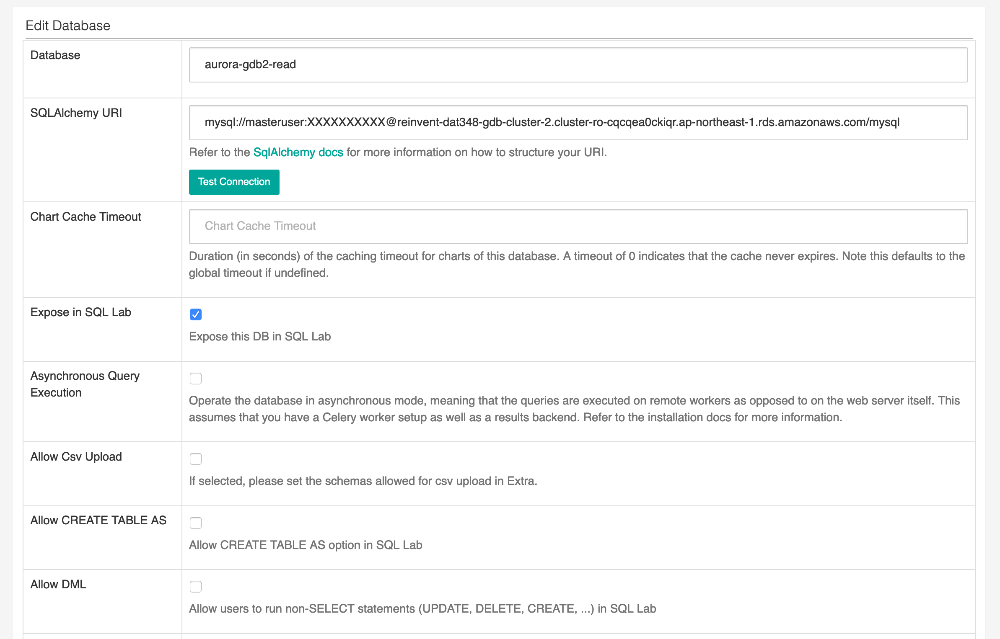

# Connect Applications

This lab contains the following tasks:

## 3. Connect BI Applications; Aurora Global Database in action

Amazon Aurora is MySQL and PostgreSQL compatible relational database engine. This means any existing applications that work with MySQL and PostgreSQL will have drop-in compatibility with Amazon Aurora. For this workshop, we will be deploying a business intelligence (BI) application that is running on Amazon EC2 instance in each region, and connect them to the respective local endpoint of the Aurora Global Database, to achieve lower query latency.

For the purpose of this workshop, we will be using [Apache Superset (incubating)](https://superset.incubator.apache.org/) as the BI web application. Superset is an open source, business intelligence and data exploration platform designed to be visual, intuitive and interactive.

<details>
<summary>Connecting to EC2 Instances - Additional Details</summary>
Those who have been familiar with AWS for a while may remember that connecting to a remote Amazon EC2 instance requires opening inbound SSH or Powershell ports, provisioning SSH keys and management of certificates. With AWS Systems Manager Session Manager, you can connect to an EC2 instance with just few clicks and experience a secure browser-based CLI, without having to provision or create SSH keys.
</details>

#

<details>
<summary>Primary Region - Application Instance Setup (Click to expand)</summary>

>  **`Region 1 (Primary)`** 

1. In the AWS Management Console, ensure that you are working within your assigned primary region. Use the Service menu and click on **Systems Manager** under Management and Governance or simply type **Systems Manager** into the search bar. This will bring up the AWS Systems Manager console.

1. Within the Systems Manager console, select **Session Manager** on the left menu. Click on the **Start Session** button.

1. You should now see your EC2 hosts that are running which you can connect to. Select ``!region1-superset-host``, then click on the **Start Session** button. This will open a new browser tab with the terminal session. Copy and paste the following commands into the terminal, and press Enter after pasting.

   1. Let's start with enabling bash on the terminal view

      ```
      source ~/.bashrc
      ```
   1. We will now create an admin user for the Apache Superset application

      ```
      fabmanager create-admin --app superset
      ```

      You will be prompted for the following:
       * Username (press enter for default)
       * First Name (press enter for default)
       * Last Name (press enter for default)
       * Email (press enter for default)
       * Password (create your password, <span style="color:red;">don't forget this!</span>)
       * Repeat for Confirmation (confirm your password)

    1. Once complete you will receive the message that admin has been created

       

    1. Next, we will run the following commands to initiate and run the Superset application in the background. Include the final ampersand "&" while copying and pasting.

       ```
       superset db upgrade
       superset load_examples
       superset init
       nohup gunicorn -b 0.0.0.0:8088 --limit-request-line 0 --limit-request-field_size 0 superset:app &
       ```

    1. The application will take a minute or two to build samples and initialize. Once you see the message similar to those below, Superset is running, with the service running by a web server on TCP port 8088. Press enter after the last command output to return to the terminal.

       ```
       [2019-xx-xx 00:00:00 +0000] [11827] [INFO] Listening at: http://0.0.0.0:8088 (11827)
       [2019-xx-xx 00:00:00 +0000] [11827] [INFO] Using worker: sync
       [2019-xx-xx 00:00:00 +0000] [11831] [INFO] Booting worker with pid: 11831
       ```

1. Return to your AWS Management Console. Use the Service menu and click on **CloudFormation** or simply type **CloudFormation** into the search bar.

1. Click on **Stacks**, and select the stack that you have deployed for this particular region. Click on the **Outputs** tab.

1. Locate the value for the key **supersetURL**, and copy to your clipboard. This value should be similar to 

    ```ec2-12-34-56-78.<xx-region-x>.compute.amazonaws.com:8088/```

1. Open a new browser tab or window. Paste the URL value into your address bar, then press enter.

1. You should see the login page for Superset. Type in ```admin``` for **Username** and the password you have entered from previous setup step.

    

1. If login is successful, you will then be taken to the Superset main dashboard.

1. Apache Superset has a number of local sample data installed on the EC2 instance. However we will not be using them for the workshop. Let's create a new datasource for Apache Superset, our Aurora Global Database.

   1. In the Apache Superset navigation menu, mouse over **Sources**, then click on **Databases**.
      

   1. Near the top right, click on the green  :heavy_plus_sign: icon to add a new database source.

   1. Change the below values and press **Save** when done:

      Field | Value and Description
      ----- | -----
      Database | <pre>aurora-gdb1-write</pre> <br> This will be the friendly name of our Aurora Database in Superset<br>&nbsp;
      SQLAlchemy URI | <pre>mysql://masteruser:mysqlpw321@<b><i>!region1GDBwriteEndpoint</i></b>/mysql</pre> <br> Replace the endpoint with the !region1clusterEndpoint in the output of your CloudFormation template. Click on **Test Connection** to confirm.<br>&nbsp;
      Expose in SQL Lab | :ballot_box_with_check:
      Allow CREATE TABLE AS | :ballot_box_with_check:
      Allow DML | :ballot_box_with_check:

      
   
   4. 

</details>

# 

<details>
<summary>Secondary Region - Application Instance Setup (Click to expand)</summary>

>  **`Region 2 (Secondary)`** 

1. We will repeat some very similar steps on the instance for the secondary region.

1. In the AWS Management Console, ensure that you are working within your assigned secondary region. Use the Service menu and click on **Systems Manager** under Management and Governance or simply type **Systems Manager** into the search bar. This will bring up the AWS Systems Manager console.

1. Within the Systems Manager console, select **Session Manager** on the left menu. Click on the **Start Session** button.

1. You should now see your EC2 hosts that are running which you can connect to. Select ``!region1-superset-host``, then click on the **Start Session** button. This will open a new browser tab with the terminal session. Copy and paste the following commands into the terminal, and press Enter after pasting.

   1. Let's start with enabling bash on the terminal view

      ```
      source ~/.bashrc
      ```
   1. We will now create an admin user for the Apache Superset application. Recommended that you reuse the same password that you have used previously in the Primary Region instance for the purpose of this workshop.

      ```
      fabmanager create-admin --app superset
      ```

      You will be prompted for the following:
       * Username (press enter for default)
       * First Name (press enter for default)
       * Last Name (press enter for default)
       * Email (press enter for default)
       * Password (create your password, <span style="color:red;">don't forget this!</span>)
       * Repeat for Confirmation (confirm your password)

    1. Once complete you will receive the message that admin has been created

       

    1. Next, we will run the following commands to initiate and run the Superset application in the background. Include the final ampersand "&" while copying and pasting.

       ```
       superset db upgrade
       superset load_examples
       superset init
       nohup gunicorn -b 0.0.0.0:8088 --limit-request-line 0 --limit-request-field_size 0 superset:app &
       ```

    1. The application will take a minute or two to build samples and initialize. Once you see the message similar to those below, Superset is running, with the service running by a web server on TCP port 8088. Press enter after the last command output to return to the terminal.

       ```
       [2019-xx-xx 00:00:00 +0000] [11827] [INFO] Listening at: http://0.0.0.0:8088 (11827)
       [2019-xx-xx 00:00:00 +0000] [11827] [INFO] Using worker: sync
       [2019-xx-xx 00:00:00 +0000] [11831] [INFO] Booting worker with pid: 11831
       ```

1. Return to your AWS Management Console. Use the Service menu and click on **CloudFormation** or simply type **CloudFormation** into the search bar.

1. Click on **Stacks**, and select the stack that you have deployed for this particular region. Click on the **Outputs** tab.

1. Locate the value for the key **supersetURL**, and copy to your clipboard. This value should be similar to 

    ```ec2-12-34-56-78.<xx-region-x>.compute.amazonaws.com:8088/```

1. Open a new browser tab or window. Paste the URL value into your address bar, then press enter.

1. You should see the login page for Superset. Type in ```admin``` for **Username** and the password you have entered from previous setup step.

    

1. If login is successful, you will then be taken to the Superset main dashboard.

1. Apache Superset has a number of local sample data installed on the EC2 instance. However we will not be using them for the workshop. Let's create a new datasource for Apache Superset, our Aurora Global Database.

   1. In the Apache Superset navigation menu, mouse over **Sources**, then click on **Databases**.
      

   1. Near the top right, click on the green  :heavy_plus_sign: icon to add a new database source.

   1. Change the below values and press **Save** when done:

      Field | Value and Description
      ----- | -----
      Database | <pre>aurora-gdb2-read</pre> <br> This will be the friendly name of our Aurora Database in Superset<br>&nbsp;
      SQLAlchemy URI | <pre>mysql://masteruser:mysqlpw321@<b><i>!region2GDBReadEndpoint</i></b>/mysql</pre> <br> Replace the endpoint with the !region2clusterEndpoint in the output of your CloudFormation template. Click on **Test Connection** to confirm.<br>&nbsp;
      Expose in SQL Lab | :x:
      Allow CREATE TABLE AS | :x:
      Allow DML | :x:

      
   
   4. 

</details>

# 

### Checkpoint:

At this point, you should have the 2 BI application instances, launched in 2 distinct regions, connected to their respective endpoints of the Global Database endpoints. Let us gather the follow data (use a notepad of your choice) and write down the following before we proceed.

> **`Region 1 (Primary)`**

* Apache Superset URL: ```ec2-12-34-56-78.<xx-region-x>.compute.amazonaws.com:8088/```
* Aurora Cluster Write Endpoint:  

> **`Region 2 (Secondary)`**

* Apache Superset URL: ```ec2-12-34-56-78.<xx-region-x>.compute.amazonaws.com:8088/```
* Aurora Cluster Read Endpoint:  

#

<details>
<summary>Aurora Global Database in Action (Click to expand)</summary>

>  **`Region 1 (Primary)`** 

1. Log in to the Primary Region instance of Apache Superset using its URL.

1. In the Apache Superset navigation menu, mouse over **SQL Lab**, then click on **SQL Editor**.
      

1. This opens up a web-based IDE within Superset. On the left menu, select ``mysql aurora-gdb1-write``, for **Database** and then select ``mylab`` for **Schema**. 


1. Copy and paste in the following SQL query and then click on **Run Query**.

   ```
   USE mylab;
   DROP TABLE IF EXISTS gdbtest1;
   DROP PROCEDURE IF EXISTS InsertRand;

   CREATE TABLE gdbtest1 (
      pk INT NOT NULL AUTO_INCREMENT, 
      gen_number INT NOT NULL,
      PRIMARY KEY (pk)
      ); 

   CREATE PROCEDURE InsertRand(IN NumRows INT, IN MinVal INT, IN MaxVal INT)
      BEGIN
         DECLARE i INT;
         SET i = 1;
         START TRANSACTION;
         WHILE i <= NumRows DO
               INSERT INTO gdbtest1 (gen_number) VALUES (MinVal + CEIL(RAND() * (MaxVal - MinVal)));
               SET i = i + 1;
         END WHILE;
         COMMIT;
      END;
      
   CALL InsertRand(1000000, 1357, 9753);

   SELECT count(pk), sum(gen_number), md5(avg(gen_number)) FROM gdbtest1;
   ```

1. This SQL creates a new table and randomly injects about 1 million records into the Global Database. Note the results in a notepad or leave the browser window open.

>  **`Region 2 (Secondary)`** 

1. Log in to the Secondary Region instance of Apache Superset using its URL.

1. In the Apache Superset navigation menu, mouse over **SQL Lab**, then click on **SQL Editor**.

1. This opens up a web-based IDE within Superset. On the left menu, select ``mysql aurora-gdb2-read``, for **Database** and then select ``mylab`` for **Schema**. 


1. Copy and paste in the following SQL query and then click on **Run Query**.

   ```
   SELECT count(pk), sum(gen_number), md5(avg(gen_number)) FROM gdbtest1;
   ```

1. Note the results, the fields should match exactly the same as the previous results in the primary instance. This includes the count of records, sum of randomly generated values, and the md5 hash of the average of the generated values.

* Bonus: you can also run the checksum command on the SQL Editor inside Superset against both the primary and secondary regions.

   ```
   CHECKSUM TABLE gdbtest1 EXTENDED;
   ```

</details>
