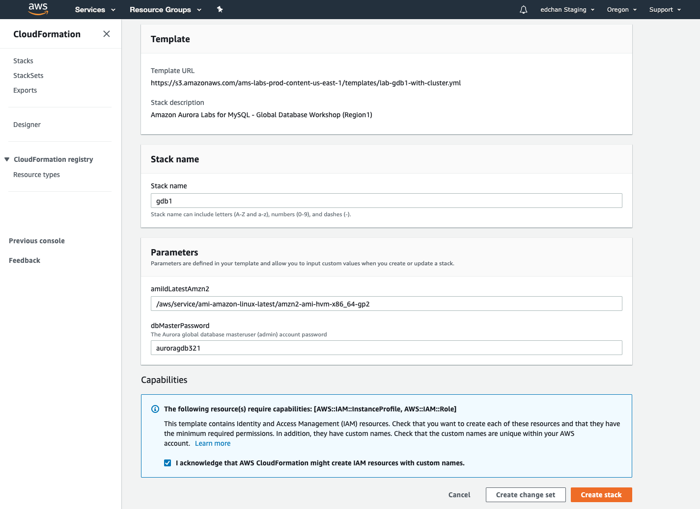
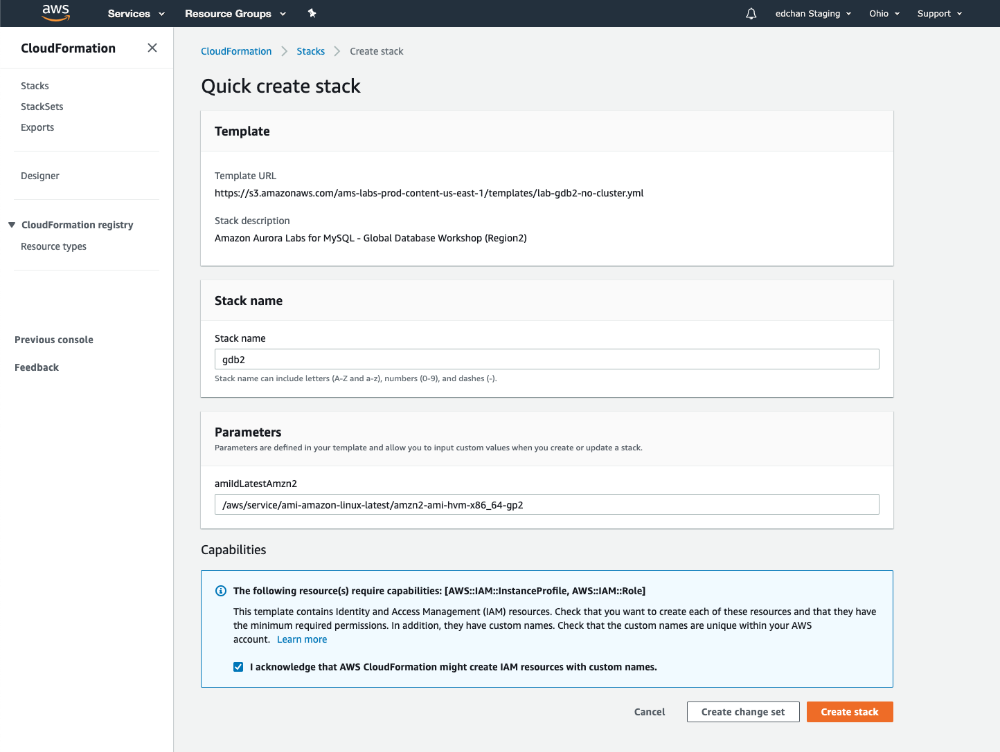

# Setup

This lab contains the following tasks:

## 1. Creating a Multi-Region workshop environment using AWS CloudFormation

To simplify the getting started experience with the labs, we have created foundational templates for <a href="https://aws.amazon.com/cloudformation/" target="_blank">AWS CloudFormation</a> that provisions the resources needed for the lab environment. The template is designed to deploy a consistent networking infrastructure, and client-side experience of software packages and components used in the workshop.

**!! templates are region-specific right now. will adjust with EE or region-specific URLs for workshop**

**Region 1 PDX / Region 2 CMH**

<b>Workshop Setup - Primary Region</b>

On the upper right corner of the AWS Console, click on the region and select your primary region assigned to you.

> **`Region 1 (Primary)`** 

Click <a href=" " target="_blank">Launch Stack</a> to deploy the workshop environment. You can also download the [lab-gdb1-with-cluster.yml](/cfn/lab-gdb1-with-cluster.yml) template and manually upload it to CloudFormation.

The desired template should be filled under **Template URL**. In the field named **Stack Name**, enter the value `gdb1`. For the **dbMasterPassword** parameter enter a password for the Aurora database that you can remember for connecting later. Leave all other parameters as default.

Scroll to the bottom, check the box that reads: **I acknowledge that AWS CloudFormation might create IAM resources with custom names** and then click **Create stack**.

The stack will take approximatively 20 minutes to provision, you can monitor the status on the **Stack detail** page. You can monitor the progress of the stack creation process by refreshing the **Events** tab. The latest event in the list will indicate `CREATE_COMPLETE` for the stack resource.

Once the status of the stack is `CREATE_COMPLETE`, click on the **Outputs** tab. The values here will be critical to the completion of the remainder of the lab.  Please take a moment to save these values somewhere that you will have easy access to them during the remainder of the lab. The names that appear in the **Key** column are referenced directly in the instructions in subsequent steps, using the parameter format: ==[outputKey]==

# 

<b>Workshop Setup - Secondary Region</b>

On the upper right corner of the AWS Console, click on your existing primary region name and switch over to the secondary region that is assigned to you.

> **`Region 2 (Secondary)`** 

Click <a href=" " target="_blank">Launch Stack</a> to deploy the workshop environment. You can also download the [lab-gdb2-no-cluster.yml](/cfn/lab-gdb2-no-cluster.yml) template and manually upload it to CloudFormation.

The desired template should be filled under **Template URL**. In the field named **Stack Name**, enter the value `gdb2`. 

Scroll to the bottom, check the box that reads: **I acknowledge that AWS CloudFormation might create IAM resources with custom names** and then click **Create stack**.

#

### Checkpoint:

At this point, you should have the base resources provisioned in the following:

> **`Region 1 (Primary)`**

* Basic VPC with public and private subnets across 3 availability zones; security groups and NAT Gateway
* VPC NACLs (for failure injection)
* Amazon EC2 Instance for Bastion Host
* Amazon EC2 Instance with Apache Superset (Our BI Application)
* Amazon Aurora Regional Cluster
* Amazon RDS DB subnet group for Aurora

> **`Region 2 (Secondary)`**

* Basic VPC with public and private subnets across 3 availability zones; security groups and NAT Gateway
* Amazon EC2 Instance for Bastion Host
* Amazon EC2 Instance with Apache Superset (Our BI Application)
* Amazon RDS DB subnet group for Aurora

